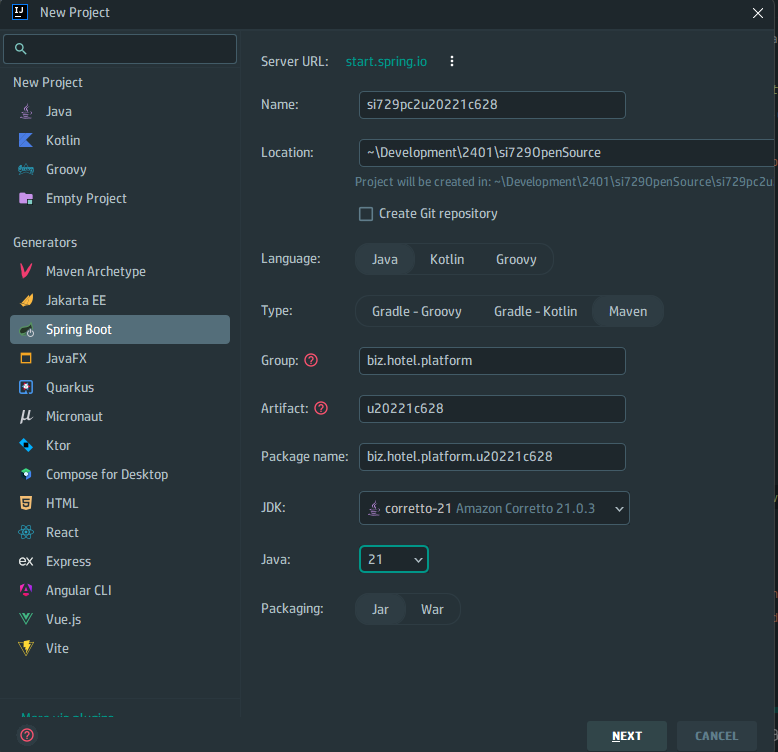
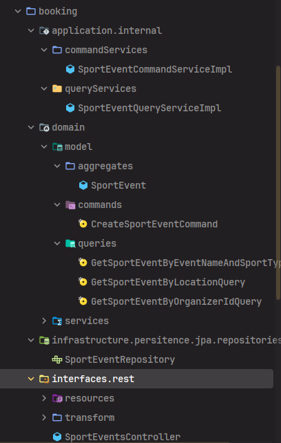

# Guía de PC2 Open source

## Manera de crear el proyecto:


No olvidar cambiar el packagename y nombre de proyecto segun lo pedido

- Importar en pom.xml las dependencias necesarias. Adjuntadas en el siguiente formado de código:
    
    ```xml
    <dependencies>
		<dependency>
			<groupId>org.springframework.boot</groupId>
			<artifactId>spring-boot-starter-data-jpa</artifactId>
		</dependency>
		<dependency>
			<groupId>org.springframework.boot</groupId>
			<artifactId>spring-boot-starter-web</artifactId>
		</dependency>

		<dependency>
			<groupId>com.mysql</groupId>
			<artifactId>mysql-connector-j</artifactId>
			<scope>runtime</scope>
		</dependency>
		<dependency>
			<groupId>org.projectlombok</groupId>
			<artifactId>lombok</artifactId>
			<optional>true</optional>
		</dependency>
		<dependency>
			<groupId>org.springframework.boot</groupId>
			<artifactId>spring-boot-starter-test</artifactId>
			<scope>test</scope>
		</dependency>

		<!-- Pluralizer -->
		<dependency>
			<groupId>io.github.encryptorcode</groupId>
			<artifactId>pluralize</artifactId>
			<version>1.0.0</version>
		</dependency>

		<!-- Swagger -->
		<dependency>
			<groupId>org.springdoc</groupId>
			<artifactId>springdoc-openapi-starter-webmvc-ui</artifactId>
			<version>2.5.0</version>
		</dependency>
	</dependencies>
    ```
  No olvidar refrescar Maven.


- Pegar carpeta Shared
- Configurar application.properties con el siguiente código base


````

# Spring DataSource configuration
spring.datasource.url=jdbc:mysql://localhost:3306/hotel?useSSL=false&serverTimezone=UTC
spring.datasource.username=root
spring.datasource.password=12345678
spring.datasource.driver-class-name=com.mysql.cj.jdbc.Driver

#Spirng Data JPA Configuration
spring.jpa.show-sql=true
#Spring JPA Hibernate Configuration
spring.jpa.hibernate.ddl-auto=update
spring.jpa.open-in-view=true

#Spring Hibernate Dialect Configuration
spring.jpa.properties.hibernate.dialect= org.hibernate.dialect.MySQLDialect
spring.jpa.hibernate.naming.physical-strategy= biz.hotel.platform.u20221c628.shared.infrastructure.persistence.jpa.configuration.strategy.SnakeCasePhysicalNamingStrategy
````


- Cambiar los datos de OPEN API en Shared. Código de prueba

 ````
 package biz.hotel.platform.u20221c628.shared.infrastructure.documentation.openapi.configuration;
import io.swagger.v3.oas.models.ExternalDocumentation;
import io.swagger.v3.oas.models.OpenAPI;
import io.swagger.v3.oas.models.info.Info;
import io.swagger.v3.oas.models.info.License;
import org.springframework.context.annotation.Bean;
import org.springframework.context.annotation.Configuration;

@Configuration
public class OpenApiConfiguration {

    @Bean
    public OpenAPI learningPlatformOpenApi(){
        //General Configuration
        var openApi = new OpenAPI();

        openApi.info(new Info()
                .title("")
                .description("")
                .version("1.0.0")
                .license(new License().name("Apache 2.0").url("http://springdoc.org")))

                .externalDocs(new ExternalDocumentation()
                        .description(" ... Documentation")
                        .url("https://acme-learning-center-platform.wiki.github.io/docs"));
        return openApi;
    }
}
 ````

- Crear la carpete del bounded context del enunciado Y la siguiente estructura de ejemplo.



- Identificar el aggregate y valueobjects del caso. Comenzamos con capa de dominio.

- Terminado con el model de dominio. Vamos a los Services dónde se declaran LAS INTERFACES.
- Declaradas nuestras interfaces y con las queries del dominio. Vamos a la capa de infraestructura con el repository.
- Implementamos los commandservices y queryservices en la capa de aplicación.
 > No olvidar el uso de @Service en los services y @Repository en los repositories.

- En las capas de servicio realizar las reglas de negocios y validaciones necesarias.

- Pasamos a la capa de interfaces. Con el patron assembler y los DTOs.
- En el controller se hacen los endpoints y se llama a los services.

````
@RestController
@RequestMapping(value = "api/v1/reservations", produces = MediaType.APPLICATION_JSON_VALUE)
@Tag(name = "Reservations", description = "Operations related to reservations")
````


- CORRE TU PROYECTO Y SUERTE! 

URLE del Swager:   http://localhost:8080/swagger-ui.html